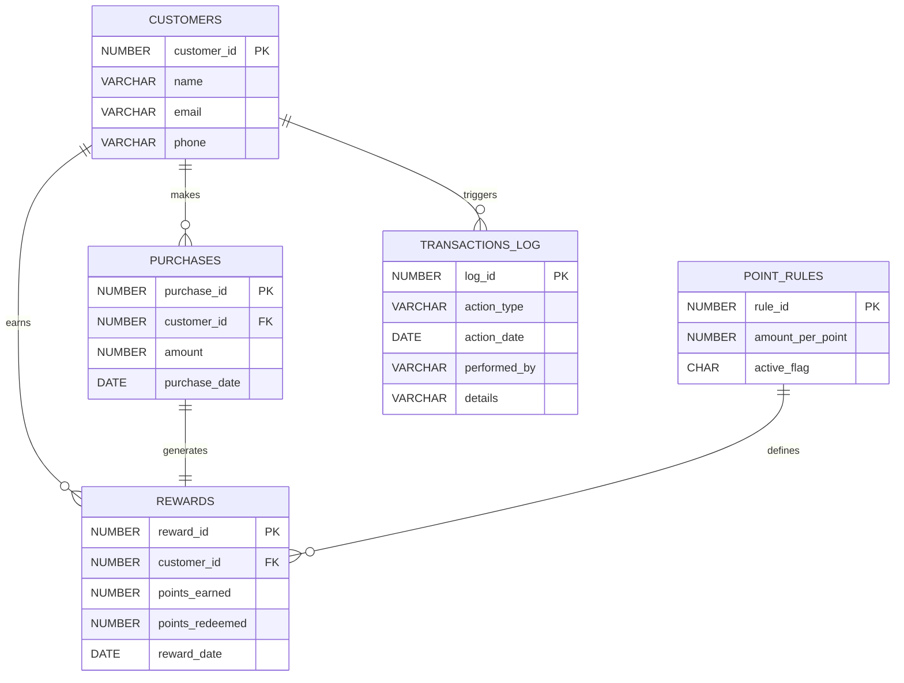

# 📊 Customer Loyalty Reward System

---

## 📑 Table of Contents

* [📌 Project Overview](#-project-overview)
* [👩‍🎓 Student Information](#-student-information)
* [❓ Problem Statement](#-problem-statement)
* [🎯 Project Objectives](#-project-objectives)
* [🧠 Key Features](#-key-features)
* [🏗️ System Architecture](#️-system-architecture)
* [🗂️ Database Design](#️-database-design)

  * [Entity Relationship Diagram (ERD)](#entity-relationship-diagram-erd)
  * [Table Descriptions](#table-descriptions)
* [⚙️ PL/SQL Implementation](#️-plsql-implementation)
* [📈 Business Intelligence & Analytics](#-business-intelligence--analytics)
* [📁 Project Structure](#-project-structure)
* [🚀 Setup & Execution](#-setup--execution)
* [🧪 Testing & Validation](#-testing--validation)
* [🌍 Innovation & Impact](#-innovation--impact)
* [📌 Conclusion](#-conclusion)

---

## 📌 Project Overview

The **Customer Loyalty Reward System** is an enterprise-style database application developed using **Oracle Database and PL/SQL**.
It enables businesses to automatically track customer purchases, calculate loyalty points, and manage reward redemptions securely and efficiently.

This system replaces manual loyalty tracking with **automated, rule-based, and auditable database logic**, making it suitable for both **academic evaluation** and **real-world deployment**.

---

## 👩‍🎓 Student Information

* **Name:** TETA HUGUETTE
* **Student ID:** 28982
* **Course:** Database Development with PL/SQL (INSY 8311)
* **Institution:** Adventist University of Central Africa (AUCA)
* **Academic Year:** 2025
* **Project Type:** Individual Capstone / Final Exam

---

## ❓ Problem Statement

Many organizations lack efficient systems to reward loyal customers due to:

* Manual record keeping
* Inaccurate point calculations
* Poor customer behavior analysis

This results in low customer retention and missed business insights.
The **Customer Loyalty Reward System** addresses this by delivering a **fully automated, secure, and analytics-ready PL/SQL solution**.

---

## 🎯 Project Objectives

* Automate customer loyalty point calculation
* Improve customer retention through rewards
* Ensure data consistency using PL/SQL constraints and triggers
* Provide audit trails for transparency
* Enable analytical reporting for decision-making

---

## 🧠 Key Features

* ✔ Automated loyalty point computation
* ✔ Trigger-based real-time updates
* ✔ Secure reward redemption logic
* ✔ Modular PL/SQL packages
* ✔ Transaction auditing and logging
* ✔ BI-ready schema design

---

## 🏗️ System Architecture

```
+----------------------+
|   User / Business    |
+----------+-----------+
           |
           v
+----------------------+
|   PL/SQL Logic       |
| (Procedures,        |
|  Functions,         |
|  Packages, Triggers)|
+----------+-----------+
           |
           v
+----------------------+
|   Oracle Database    |
| (Tables, Constraints|
|  Indexes, Logs)     |
+----------------------+
           |
           v
+----------------------+
| Business Intelligence|
| & Analytics Queries |
+----------------------+
```

---

## 🗂️ Database Design

### Entity Relationship Diagram (ERD)

#### 🔹 Conceptual ER Diagram (Readable View)

```
CUSTOMERS
---------
customer_id (PK)
name
email
phone

   1
   |
   | purchases
   |
   ∞
PURCHASES
---------
purchase_id (PK)
customer_id (FK)
amount
purchase_date

   1
   |
   | generates
   |
   1
REWARDS
-------
reward_id (PK)
customer_id (FK)
points_earned
points_redeemed
reward_date

POINT_RULES
-----------
rule_id (PK)
amount_per_point
active_flag

TRANSACTIONS_LOG
----------------
log_id (PK)
action_type
action_date
performed_by
details
```

---

### 🔹 GitHub-Rendered ER Diagram (Mermaid)

> ✅ **GitHub automatically renders this**



---

### Table Descriptions

| Table            | Purpose                           |
| ---------------- | --------------------------------- |
| CUSTOMERS        | Stores customer details           |
| PURCHASES        | Records customer purchases        |
| REWARDS          | Tracks points earned and redeemed |
| POINT_RULES      | Defines loyalty conversion rules  |
| TRANSACTIONS_LOG | Logs automated database actions   |

---

## ⚙️ PL/SQL Implementation

### Implemented Components

* **Procedures**

  * Record purchases
  * Redeem loyalty points
* **Functions**

  * Calculate total points
  * Validate customer data
* **Triggers**

  * Auto-calculate points after purchase
  * Enforce business rules
* **Packages**

  * Group loyalty logic
* **Cursors**

  * Process bulk customer data
* **Exceptions**

  * Handle invalid operations

---

## 📈 Business Intelligence & Analytics

The system supports:

* Customer spending trends
* Top loyal customers
* Reward redemption frequency
* Monthly and yearly performance analysis

Designed for easy integration with BI tools and dashboards.

---

## 📁 Project Structure

```bash
customer-loyalty-reward-system/
├── README.md
├── database/
│   └── scripts/
├── queries/
├── business_intelligence/
├── screenshots/
└── documentation/
```

---

## 🚀 Setup & Execution

1. Create Oracle PDB
2. Run table creation scripts
3. Insert sample data
4. Compile PL/SQL objects
5. Execute test queries
6. Review audit logs

---

## 🧪 Testing & Validation

* Procedures tested with edge cases
* Triggers validated for correctness
* Constraints enforced
* Audit logs verified

---

## 🌍 Innovation & Impact

This project introduces a simple but powerful way for businesses to manage customer loyalty using database automation instead of manual work.

Unlike traditional systems where loyalty points are calculated by hand or outside the database, this solution uses PL/SQL procedures and triggers to calculate points automatically and instantly whenever a customer makes a purchase. This reduces human errors and ensures that customer rewards are always accurate and up to date.

The system also improves business decision-making by organizing customer and purchase data in a clean, structured way. Managers can easily analyze customer spending patterns, identify loyal customers, and understand how rewards influence repeat purchases.

Overall, this project helps businesses:

Save time by automating loyalty management

Improve customer satisfaction through fair and transparent rewards

Maintain secure and reliable data

Make better decisions using clear and organized data

---

## 📌 Conclusion

The Customer Loyalty Reward System successfully demonstrates how Oracle Database and PL/SQL can be used to build a reliable, automated, and real-world business solution. By combining structured database design with procedures, functions, triggers, and auditing, the system ensures accurate loyalty point management and secure transaction handling.

This project shows practical skills in database modeling, PL/SQL programming, and business-oriented thinking. It transforms raw customer and purchase data into useful information that can help businesses improve customer retention and understand buying behavior.

Overall, the project is not only an academic requirement but also a practical foundation for real enterprise systems, proving the ability to design, implement, and document a professional database application ready for future expansion and analytics.
---

